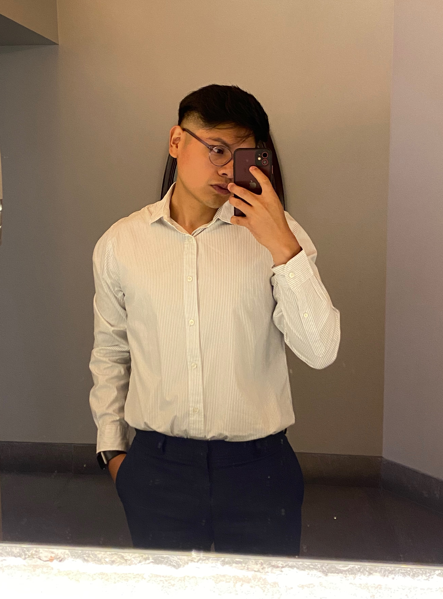

### Hello, I'm Luis 🧑🏽‍💻

“El glamour está en tu cerebro, no en tus ojos”. - Óscar de la Renta

Nunca sé como iniciar mis presentaciones pero vamoa ver :D.
Soy Luis Castro aunque mi primer apellido es Pérez pero shhh 🫢, actualmente curso la carrera de Ingeniería Mecatrónica en la Facultad de Ingeniería, voy en séptimo semestre y recientemente he decidido aprender idiomas y la `programación`, estoy por terminar el inglés en la ENALLT y el pasado agosto j'ai commencé à étudier le français 🇫🇷 en la misma escuela. 

Me gusta siempre mantenerme activo, haciendo cursos, proyectos, aprendiendo algo nuevo, también disfruto demasiado jugar videojuegos como COD mobile y en consola Red of Dead Redemption o FIFA jaja

Me gusta ver el fútbol pero no practicarlo, me gusta tambíen ver otros deportes como el baloncesto o el americano pero no soy tan aficionado como con partidos de Champions League, me gusta leer sobre temas de tecnología y programación y algunos libros sobre temas de la vida, actualmente no practico ningún deporte pero el siguiente semestre espero entrar a jugar futbol americano o a practicar boxeo. 

Escucho todo tipo de música pero la mayoría del tiempo escucho electrónica, el género latino, un poco de rap, corridos tumbados y trap en inglés; me gusta siempre andar descubriendo nuevas canciones y en algún momento me gustaría aprender a realizar una pista y comprarme una MIDI, si tienes alguna recomendación mandala a mi ig [@luuissc_](https://www.instagram.com/luuissc_/) lo agradeceré mucho :D

Desde que voy en segundo semestre de la carrera comencé a vivir solo y la verdad creo que es una experiencia que me ha permitido crecer como persona, y en conjunto con los conocimientos adquiridos en la facultad me ha permitido ser ahora quien soy. 

Quiero seguir aprendiendo nuevas cosas en especial sobre mi carrera y sobre programación por ello también decidí aplicar a SIAFI espero vengan tiempos mejores. 